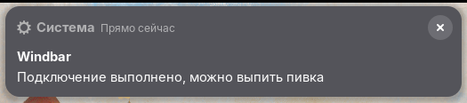

# Windbar

[](https://github.com/mikanight/windbar/releases)
[](metadata.json)
[](LICENSE)
[](https://github.com/mikanight/windbar/stargazers)



Windbar is a GNOME Shell extension for controlling Windscribe from the desktop
panel through `windscribe-cli`.

It provides a quick way to check the VPN state and perform common actions
without opening the Windscribe application or a terminal. Windbar is an
independent project and is not affiliated with Windscribe.

## Features

- monochrome Windscribe logo in the panel;
- current connection state, location, protocol and VPN IP;
- connect to the best location and disconnect;
- desktop notification when the connection is established;
- locations grouped under region headers;
- favorite locations toggled with a star directly in the locations menu;
- firewall on/off control;
- protocol selection: Auto, WireGuard, OpenVPN UDP/TCP, Stealth and WStunnel;
- IP rotation and current IP pinning when supported by the account;
- clear states for a missing CLI or an unauthenticated account;
- copy the login command to the clipboard;
- configurable refresh interval, default protocol and panel position;
- serialized CLI calls with a timeout and retry handling for a busy Windscribe CLI.

## Requirements

- GNOME Shell 50 or 51;
- `windscribe-cli` installed and available in `PATH`;
- a completed `windscribe-cli login`.

## Installation

Install and authenticate Windscribe CLI according to its documentation first:

```bash
windscribe-cli login
```

### From a release

Download the latest `windbar@mikanight.shell-extension.zip` from the
[Releases](https://github.com/mikanight/windbar/releases) page and install it
without repackaging:

```bash
gnome-extensions install --force windbar@mikanight.shell-extension.zip
gnome-extensions enable windbar@mikanight
```

Releases are built automatically by GitHub Actions every time a tag is pushed.

### Build from source

Clone and package Windbar:

```bash
git clone https://github.com/mikanight/windbar.git
cd windbar

gnome-extensions pack -f -o /tmp \
  --extra-source=cli.js \
  --extra-source=parser.js \
  --extra-source=windbar-connected.svg \
  --extra-source=windbar-disconnected.svg \
  .

gnome-extensions install --force /tmp/windbar@mikanight.shell-extension.zip
gnome-extensions enable windbar@mikanight
```

If GNOME does not discover the extension immediately on Wayland, log out and
back in once. The `schemas/` directory is compiled automatically during
installation.

## Configuration

Open the preferences window with:

```bash
gnome-extensions prefs windbar@mikanight
```

Available settings:

- default connection protocol;
- status refresh interval from 5 to 3600 seconds;
- panel position: left, center (next to the clock) or right.

## Notes

When the Windscribe GUI client is running, `windscribe-cli locations` may hand
the request to the GUI and return no location list. In that case, close the GUI
client or use the CLI-only setup.

IP rotation and IP pinning require an active connection and a Windscribe plan
that supports those operations.

## Privacy

Windbar reads connection details from the locally installed `windscribe-cli`.
It does not save the VPN IP in GSettings or send it to a Windbar service; the IP
is shown in the status menu only while connected. The CLI handles its own
network requests and account data.

## Development

Run the parser self-test and a live CLI smoke test from the repository root:

```bash
./test.sh
```

The live test requires an installed, authenticated `windscribe-cli`.

## Releases

Releases are built and attached automatically by GitHub Actions when a tag is
pushed. To publish a new release:

```bash
git tag -a 1.0.0 -m "Release 1.0.0"
git push origin 1.0.0
```

## Contributing

Issues and pull requests are very welcome. Bug reports, compatibility fixes,
UI improvements and support for additional GNOME Shell versions are especially
useful.

For bug reports, include the GNOME Shell version, `windscribe-cli` version and
relevant logs. Do not include account credentials, tokens or private network
information.

## License

Windbar is distributed under the GNU General Public License version 3 or later
(GPL-3.0-or-later). See [LICENSE](LICENSE).
